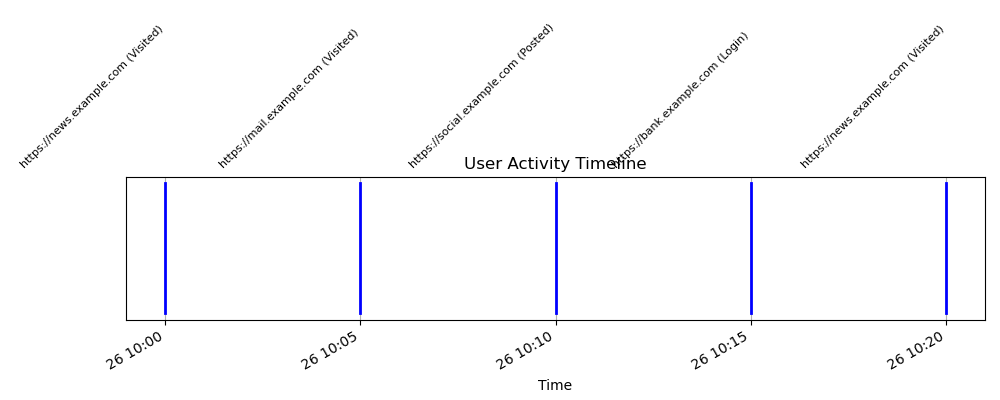

# Digital Artifact Timeline Analyzer
This project creates a visual timeline of user activity from log data (for instance; browser history). It’s designed for digital forensics and cybersecurity, demonstrating skills in data parsing, timestamp analysis, and visualization.

## Features
- Parses CSV log files with timestamps, websites, and actions.
- Generates a timeline plot showing events over time.
- Calculates time differences between events for forensic analysis.

## How to Run
1. Ensure Python 3.x is installed.
2. Install required libraries: `pip install pandas matplotlib`.
3. Place a CSV file (e.g., `browser_history.csv`) with columns: `timestamp`, `website`, `action`.
4. Run `python timeline_analyzer.py` to generate `timeline.png`.

## Output
- `timeline.png`: A visual timeline of the activity (see below).

