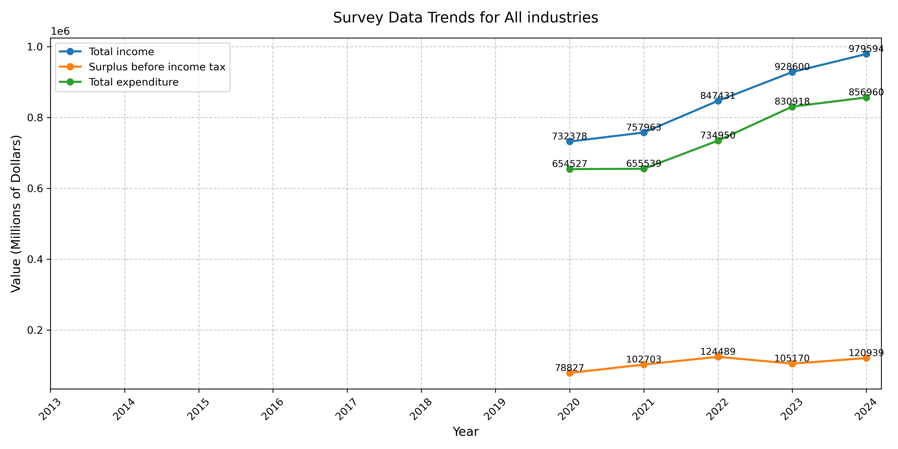

# Forensic Finance Analyzer

The **Forensic Finance Analyzer** is a Python-based tool designed to analyze data (e.g., the Annual Enterprise Survey 2024) and generate visual timelines to identify trends and anomalies. This project demonstrates skills in data parsing, visualization, and version control, making it relevant for digital forensic analysis, financial auditing, and cybersecurity investigations.

## Features
- Parses CSV files containing financial metrics (e.g., income, expenditure, surplus).
- Generates a clear line plot (`survey.png`) showing trends over years with annotated values.
- Filters data by industry (e.g., 'All industries', 'Horticulture and Fruit Growing') for focused analysis.
- Handles large datasets with robust error checking.

## How to Run
1. Ensure Python 3.x is installed.
2. Install required libraries: `pip install pandas matplotlib`.
3. Place the CSV file (e.g., `annual_enterprise_survey_2024.csv`) in the project folder.
4. Run `python timeline_analyzer.py` to generate `survey.png`.

## Output
- `survey.png`: A visual representation of financial trends (see below).

## Skills Demonstrated
- Data parsing and cleaning with Pandas.
- Data visualization with Matplotlib.
- Version control and collaboration using Git.
- Attention to detail for forensic-grade reporting.

## Potential Applications
- Forensic analysis of financial records for irregularities.
- Auditing enterprise financial performance over time.
- Supporting investigations with visual evidence.

## Future Enhancements
- Support for multiple CSV formats.
- Interactive plots for deeper analysis.
- Automated anomaly detection.