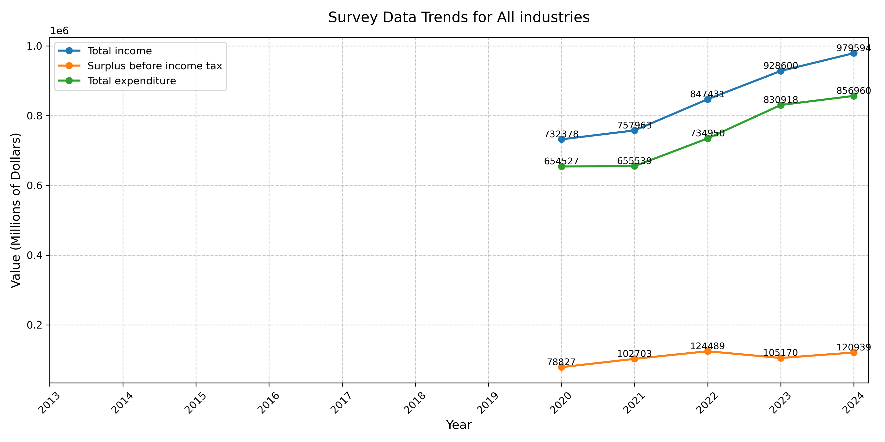

# 🔍 Project: Forensic Finance Analyzer

### 📋 Project Specifications
* **Primary Function:** Financial Anomaly Detection & Trend Visualization
* **Core Engine:** Python `Pandas` (High-performance data manipulation)
* **Visualization:** `Matplotlib` (Forensic-grade timeline generation)
* **Operational Status:** STABLE / Testing Complete
* **Application:** Auditing, Digital Forensics, and Financial Incident Response

---

### 🔬 Technical Methodology
This tool is engineered to ingest large-scale enterprise datasets (CSV) and identify statistical deviations over time. By applying industry-specific filters, it allows investigators to isolate specific sectors—such as "Horticulture" or "Manufacturing"—to identify irregular expenditure spikes or income anomalies.

**The Analytical Workflow:**
1. **Data Ingestion:** Loads raw CSV data into a structured Pandas DataFrame.
2. **Feature Extraction:** Filters data points based on variables (e.g., Total income, Surplus) and Industry sectors.
3. **Forensic Mapping:** Generates an annotated line plot to visualize year-on-year trends, providing visual evidence for financial audits.

---

### 🛠️ Key Features
* **Automated Parsing:** Efficient handling of large CSV datasets.
* **Trend Analysis:** Visualizes income vs. expenditure to highlight surplus gaps.
* **Anomaly Identification:** Annotates data points to help investigators spot spikes quickly.
* **Forensic Integrity:** Maintains the original data structure while generating reports.

---

### 📊 Forensic Output

*Above: A visual analysis of enterprise financial trends used to support technical auditing findings.*

---

### 🚀 Installation & Execution
```bash
# 1. Install Analytics Stack
pip install pandas matplotlib

# 2. Prepare Data
# Ensure your CSV file is in the root directory

# 3. Execute Analysis
python timeline_analyzer.py
